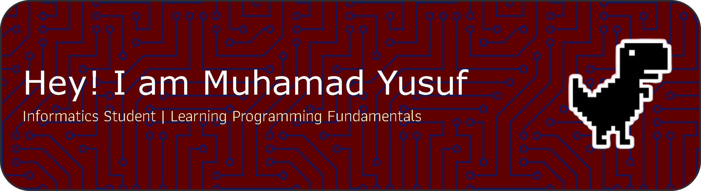

## Hello World! I'm Muhamad Yusuf👋

<!--
**myusuf100607-create/myusuf100607-create** is a ✨ _special_ ✨ repository because its `README.md` (this file) appears on your GitHub profile.

Here are some ideas to get you started:

- 🔭 I’m currently working on ...
- 🌱 I’m currently learning ...
- 👯 I’m looking to collaborate on ...
- 🤔 I’m looking for help with ...
- 💬 Ask me about ...
- 📫 How to reach me: ...
- 😄 Pronouns: ...
- ⚡ Fun fact: ...
-->
##### Programming Language
  

##### Using AI Tools
 

##### Connect with me
  

🎓 Studying Informatics at **[Universitas Teknologi Bandung](https://www.utb-univ.ac.id)**

🌱 Currently Learning
- Python (basic programming)
- Algorithms & logic
- Data structures (list, dictionary)